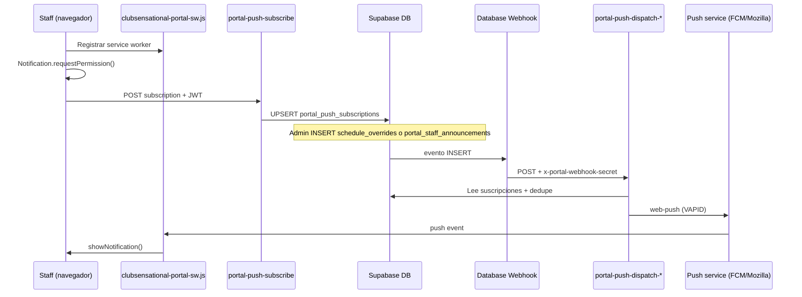

# Web Push — PORTALVIC — guía completa de puesta en marcha

### No confundir (tres cosas distintas)

| Qué | Nombre / URL | Notas |
|---|---|---|
| **Backend (BD + Auth + Edge Functions)** | Supabase proyecto **`portal`** · ref `cklpnwhlqsulpmkipmqb` | `https://cklpnwhlqsulpmkipmqb.supabase.co` |
| **Frontend en producción (Vercel)** | **PORTALVIC** · `https://portalvic.vercel.app/` | Login, staff, lead, admin — **este es el portal real** |
| ~~Otro deploy Vercel~~ | ~~`clubsensational-portal-2026.vercel.app`~~ | **No usar** en esta guía; no es producción PORTALVIC |

**URLs de producción PORTALVIC (Vercel):**

| Página | URL |
|---|---|
| Login | https://portalvic.vercel.app/ (→ `login.html`) |
| Staff dashboard | https://portalvic.vercel.app/staff_dashboard.html |
| Lead dashboard | https://portalvic.vercel.app/lead_dashboard.html |

Al pulsar una notificación push, el navegador abre la URL del secret **`PORTAL_PUSH_OPEN_URL`**, que debe ser **`https://portalvic.vercel.app/staff_dashboard.html`** (sin barra final).

Esta guía es la checklist única para que las notificaciones lleguen **con la app cerrada o el móvil bloqueado**.

---

## 1. Qué hace el sistema (en una frase)

1. El staff **activa notificaciones** en el dashboard → el navegador registra un **Service Worker** y guarda la suscripción en `portal_push_subscriptions`.
2. Cuando admin crea un **cambio de roster** (`schedule_overrides`) o un **anuncio** (`portal_staff_announcements`), un **Database Webhook** llama a una **Edge Function**.
3. La función envía el push con **VAPID** a todos los dispositivos suscritos del staff afectado.



---

## 2. Auditoría rápida — qué ya tienes (junio 2026)

Revisado contra el repo + `supabase secrets list` + `supabase functions list` en el proyecto **Portal**.

| Componente | Estado | Notas |
|---|---|---|
| Tabla `portal_push_subscriptions` | ✅ Migración en repo | `supabase/migrations/20260430140000_portal_web_push.sql` |
| Tabla `portal_webpush_override_sent` | ✅ | Evita duplicados por override |
| Tabla `portal_webpush_announcement_sent` | ✅ | `20260601140000_portal_webpush_announcement_sent.sql` |
| Función `portal_session_date_in_push_horizon` | ✅ | Solo envía pushes para sesiones hoy…+14 días (London) |
| Edge Function `portal-push-subscribe` | ✅ ACTIVE v18 | Guarda suscripción del dispositivo |
| Edge Function `portal-push-dispatch-schedule-override` | ✅ ACTIVE v17 | Roster: make-up, ausencia, slot reopened |
| Edge Function `portal-push-dispatch-announcement` | ✅ ACTIVE v1 | Anuncios staff |
| Secret `VAPID_PUBLIC_KEY` | ✅ | Solo en Supabase Edge Secrets |
| Secret `VAPID_PRIVATE_KEY` | ✅ | **Nunca** en el frontend ni en git |
| Secret `PORTAL_PUSH_OPEN_URL` | ⚠️ **Verificar valor** | Debe ser `https://portalvic.vercel.app/staff_dashboard.html` — si apunta a otro dominio Vercel, corregir (§4) |
| Secret `PORTAL_PUSH_WEBHOOK_SECRET` | ✅ | Lo usa el header del webhook |
| Secret `VAPID_SUBJECT` | ⚠️ Opcional | Si no existe, el código usa `mailto:hello@clubsensational.org` |
| Service Worker `clubsensational-portal-sw.js` | ✅ | En `working_ui/` (Vercel lo sirve en la raíz) |
| Código suscripción en dashboards | ✅ | `staff_dashboard.html` + `lead_dashboard.html` |
| **`window.__PORTAL_VAPID_PUBLIC_KEY__` en producción** | ❌ **Falta** | Sin esto el staff ve *"alerts when app is closed need ops setup"* |
| **Database Webhooks (2)** | ❌ **Verificar / crear** | No se pueden commitear; solo Dashboard Supabase |
| Filas en `portal_push_subscriptions` | ❌ **Probablemente 0** | Hasta que alguien active notificaciones con VAPID puesto |

**Conclusión:** Backend casi listo. Lo que falta para que funcione de verdad suele ser **(A) clave VAPID pública en la página** y **(B) los dos webhooks en el Dashboard**.

---

## 3. Archivos del repo (referencia)

| Qué | Ruta |
|---|---|
| Migración base push | `supabase/migrations/20260430140000_portal_web_push.sql` |
| Horizonte de fechas push | `supabase/migrations/20260430140100_portal_push_session_horizon.sql` |
| Dedupe anuncios | `supabase/migrations/20260601140000_portal_webpush_announcement_sent.sql` |
| Suscribir dispositivo | `supabase/functions/portal-push-subscribe/index.ts` |
| Enviar por roster | `supabase/functions/portal-push-dispatch-schedule-override/index.ts` |
| Enviar por anuncio | `supabase/functions/portal-push-dispatch-announcement/index.ts` |
| Service worker | `working_ui/clubsensational-portal-sw.js` |
| UI + registro push | `working_ui/staff_dashboard.html`, `working_ui/lead_dashboard.html` |
| Generador local de par VAPID | `working_ui/vapid-key-generator.html` (solo en local; no subir claves a git) |

---

## 4. Secrets de Edge Functions (Supabase)

**Dashboard:**  
[https://supabase.com/dashboard/project/cklpnwhlqsulpmkipmqb/settings/functions](https://supabase.com/dashboard/project/cklpnwhlqsulpmkipmqb/settings/functions)  
→ pestaña **Secrets** (o *Edge Functions → Manage secrets*).

### 4.1 Secrets obligatorios

| Secret | Valor correcto | ¿Ya existe? |
|---|---|---|
| `VAPID_PUBLIC_KEY` | Cadena base64url (par generado con web-push) | ✅ |
| `VAPID_PRIVATE_KEY` | Pareja de la anterior | ✅ |
| `PORTAL_PUSH_OPEN_URL` | `https://portalvic.vercel.app/staff_dashboard.html` | ⚠️ **Comprobar en Dashboard** — debe ser portalvic, sin `/` final |
| `PORTAL_PUSH_WEBHOOK_SECRET` | String largo aleatorio (≥32 caracteres) | ✅ |
| `SUPABASE_URL` | `https://cklpnwhlqsulpmkipmqb.supabase.co` | ✅ (auto) |
| `SUPABASE_SERVICE_ROLE_KEY` | service role del proyecto | ✅ (auto) |
| `SUPABASE_ANON_KEY` | anon key (solo la usa `portal-push-subscribe`) | ✅ (auto) |

### 4.2 Secret recomendado (opcional)

```text
VAPID_SUBJECT=mailto:hello@clubsensational.org
```

Si no lo pones, las funciones usan ese valor por defecto en código.

### 4.3 Comprobar / cambiar un secret por CLI

Desde la carpeta del repo (con Supabase CLI logueado y proyecto enlazado):

```powershell
cd C:\Users\info\PORTAL
supabase secrets list
```

Para **actualizar** (ejemplo URL del dashboard):

```powershell
supabase secrets set PORTAL_PUSH_OPEN_URL="https://portalvic.vercel.app/staff_dashboard.html"
```

**Importante:** Tras cambiar secrets, las Edge Functions los leen en la **siguiente invocación** (no hace falta redeploy solo por un secret).

### 4.4 Si necesitas generar un par VAPID nuevo

Solo si rotáis claves (invalida suscripciones antiguas):

```powershell
npx web-push generate-vapid-keys
```

O abrid en local `working_ui/vapid-key-generator.html` en el navegador.

Luego:

```powershell
supabase secrets set VAPID_PUBLIC_KEY="LA_CLAVE_PUBLICA"
supabase secrets set VAPID_PRIVATE_KEY="LA_CLAVE_PRIVADA"
```

La **misma** clave pública debe ir al frontend (§5).

---

## 5. Frontend — clave VAPID pública (PASO CRÍTICO)

El staff dashboard **no** incluye la clave privada. Solo necesita la **pública**, idéntica a `VAPID_PUBLIC_KEY` en Supabase.

### 5.1 Dónde copiar la clave pública

1. Supabase Dashboard → **Edge Functions → Secrets** → copiar valor de `VAPID_PUBLIC_KEY`.  
2. Es una sola línea, tipo: `BEl62iUYgUivxIkv69yViEuiBIa-I...` (ejemplo; usa la tuya).

### 5.2 Opción A — Vercel directo (recomendado si no usáis iframe WordPress)

Añadir **antes** de cargar `staff_dashboard.html` / `lead_dashboard.html` (por ejemplo en `login.html` o en un snippet común):

```html
<script>
  window.__PORTAL_VAPID_PUBLIC_KEY__ = "PEGAR_AQUI_VAPID_PUBLIC_KEY";
</script>
```

**Sitios que deben tenerlo (producción PORTALVIC):**

- https://portalvic.vercel.app/staff_dashboard.html
- https://portalvic.vercel.app/lead_dashboard.html

Si el staff entra por https://portalvic.vercel.app/ → `login.html` → dashboard, basta poner el script en `working_ui/login.html` **en el `<head>`** y desplegar a Vercel (proyecto **portalvic**).

### 5.3 Opción B — Portal embebido en WordPress / Elementor

En la página que contiene el **iframe** del portal, bloque **HTML personalizado** *encima* del iframe:

```html
<script>
  window.__PORTAL_VAPID_PUBLIC_KEY__ = "PEGAR_AQUI_VAPID_PUBLIC_KEY";
</script>
```

El iframe debe ser **mismo origen** que el portal (ideal: el iframe apunta a Vercel, no a otro dominio). Si el iframe es otro dominio, `window.__PORTAL_VAPID_PUBLIC_KEY__` del padre **no** llega al hijo — en ese caso la clave debe ir **dentro** del HTML del dashboard en Vercel (opción A).

### 5.4 Desplegar el cambio

```powershell
git add working_ui/login.html
git commit -m "Expose VAPID public key for Web Push subscription"
git push
```

Vercel (**portalvic**) redeploya `working_ui/` automáticamente desde este repo.

### 5.5 Comprobar en el navegador (DevTools)

1. Abrir https://portalvic.vercel.app/staff_dashboard.html logueado.  
2. Consola → escribir: `window.__PORTAL_VAPID_PUBLIC_KEY__`  
3. Debe devolver la cadena (no `undefined` ni `""`).  
4. Ajustes → **Alerts & notifications** → *Turn on notifications*.  
5. El texto debe pasar a: **"On — including alerts when the app is closed."**  
6. Si dice *"need ops setup"* → falta la clave VAPID (§5.2).

---

## 6. Database Webhooks (PASO CRÍTICO — solo Dashboard)

Los webhooks **no** viven en git. Hay que crearlos a mano.

**Dashboard (UI moved):**  
[https://supabase.com/dashboard/project/cklpnwhlqsulpmkipmqb/integrations/webhooks/overview](https://supabase.com/dashboard/project/cklpnwhlqsulpmkipmqb/integrations/webhooks/overview)  
*(La ruta antigua `/database/hooks` devuelve 404.)*

**En Portal ya existe** un trigger SQL `schedule-overrides-web-push` en `schedule_overrides` (INSERT). Si el push de roster devolvía **403**, suele faltar el header `x-portal-webhook-secret` en ese trigger — ver §6.4.

Necesitas el valor de `PORTAL_PUSH_WEBHOOK_SECRET` (Edge Secrets). **No lo pegues en documentos públicos** — cópialo del Dashboard al crear el webhook.

### 6.1 Webhook — cambios de roster

| Campo | Valor |
|---|---|
| **Name** | `portal-push-schedule-override` |
| **Table** | `schedule_overrides` |
| **Events** | ☑ **Insert** (con UPDATE opcional si reactiváis overrides) |
| **Type** | HTTP Request |
| **Method** | POST |
| **URL** | `https://cklpnwhlqsulpmkipmqb.supabase.co/functions/v1/portal-push-dispatch-schedule-override` |
| **HTTP Headers** | Nombre: `x-portal-webhook-secret` — Valor: `<PORTAL_PUSH_WEBHOOK_SECRET>` |
| **Timeout** | 5000 ms o más |

**Tipos de override que disparan push** (resto se ignoran):

- `client_replace_in_slot` (make-up)
- `client_absence_announced`
- `slot_open` (bloque cerrado reabierto)

Solo filas con `status = active` y `session_date` dentro del horizonte **hoy … +14 días** (Europe/London).

### 6.2 Webhook — anuncios staff

| Campo | Valor |
|---|---|
| **Name** | `portal-push-announcement` |
| **Table** | `portal_staff_announcements` |
| **Events** | ☑ **Insert** |
| **URL** | `https://cklpnwhlqsulpmkipmqb.supabase.co/functions/v1/portal-push-dispatch-announcement` |
| **HTTP Headers** | Igual: `x-portal-webhook-secret: <PORTAL_PUSH_WEBHOOK_SECRET>` |

Respeta `audience_scope` y `ends_at` del anuncio.

### 6.4 Portal roster — trigger SQL (alternativa al Dashboard)

En el proyecto **Portal** el webhook de roster **ya está** como trigger Postgres (no hace falta la UI si está bien configurado):

```sql
-- Comprobar:
select pg_get_triggerdef(oid)
from pg_trigger
where tgname = 'schedule-overrides-web-push';
```

Debe incluir en los headers JSON: `"x-portal-webhook-secret":"<PORTAL_PUSH_WEBHOOK_SECRET>"`.

Si solo tiene `Content-Type`, la Edge Function responde **403**. Reparar con la migración plantilla  
`database/migrations/20260601174600_portal_fix_schedule_override_push_webhook.sql`  
(sustituir `__PORTAL_PUSH_WEBHOOK_SECRET__` en SQL Editor y ejecutar).

**Estado jun 2026:** trigger reparado en remoto con header correcto.

---

Tras crear el webhook, Supabase suele ofrecer **"Send test webhook"** o podéis insertar una fila de prueba en SQL Editor y mirar:

- **Edge Functions → Logs** de la función correspondiente  
- Respuesta HTTP **200** (no 403 Forbidden — eso es secret mal puesto)

---

## 7. Migraciones SQL (si el proyecto remoto no las tuviera)

En orden, en **SQL Editor** del proyecto Portal o vía CLI cuando la conexión DB funcione:

1. `supabase/migrations/20260430140000_portal_web_push.sql`  
2. `supabase/migrations/20260430140100_portal_push_session_horizon.sql`  
3. `supabase/migrations/20260601140000_portal_webpush_announcement_sent.sql`  

Comprobar tablas:

```sql
select count(*) from public.portal_push_subscriptions;
select count(*) from public.portal_webpush_override_sent;
select count(*) from public.portal_webpush_announcement_sent;
```

---

## 8. Desplegar / redeploy Edge Functions (referencia)

Solo si cambiáis código en `supabase/functions/`:

```powershell
cd C:\Users\info\PORTAL
supabase functions deploy portal-push-subscribe
supabase functions deploy portal-push-dispatch-schedule-override
supabase functions deploy portal-push-dispatch-announcement
```

**Estado actual:** las tres están **ACTIVE** en remoto; no hace falta redeploy salvo cambios de código.

---

## 9. Prueba end-to-end (checklist operativa)

### Paso 1 — Dispositivo staff

1. Móvil o PC con **Chrome/Edge/Firefox** (Safari iOS tiene limitaciones PWA).  
2. **HTTPS** obligatorio — https://portalvic.vercel.app ✅.  
3. Login en portalvic → **Settings → Alerts & location** → **Turn on notifications** → aceptar permiso.  
4. Texto: *"On — including alerts when the app is closed."*  
5. SQL (como admin):

   ```sql
   select user_id, left(endpoint, 60) as endpoint_preview, updated_at
   from public.portal_push_subscriptions
   order by updated_at desc
   limit 10;
   ```

   Debe aparecer **≥1 fila** con el `user_id` del staff.

### Paso 2 — Push de roster

1. Admin portal → **Scheduling & Cover** → crear override elegible (ej. anunciar ausencia o make-up) para un instructor que **tenga suscripción** y sesión en los próximos 14 días.  
2. Cerrar pestaña del staff (o bloquear móvil).  
3. Debe llegar notificación; al pulsar abre `staff_dashboard.html` (o añade `?portalOpen=alerts`).

### Paso 3 — Push de anuncio

1. Admin → publicar fila en `portal_staff_announcements` (o UI de anuncios si la usáis).  
2. Staff suscrito debe recibir push con título/cuerpo del anuncio.

### Paso 4 — Logs si falla

| Síntoma | Dónde mirar |
|---|---|
| 403 Forbidden en webhook | Header `x-portal-webhook-secret` ≠ secret en Edge |
| 500 Server misconfigured | Falta VAPID o `PORTAL_PUSH_OPEN_URL` en secrets |
| Suscripción no se guarda | JWT / login; logs `portal-push-subscribe` |
| Permiso OK pero no "closed app" | Falta `__PORTAL_VAPID_PUBLIC_KEY__` |
| Webhook OK pero no push | 0 filas en `portal_push_subscriptions`; o sesión fuera de horizonte +14d |
| Push solo in-app | Service worker no registrado; probar fuera de iframe |

**Logs Edge Functions:**  
[https://supabase.com/dashboard/project/cklpnwhlqsulpmkipmqb/functions](https://supabase.com/dashboard/project/cklpnwhlqsulpmkipmqb/functions) → función → **Logs**.

---

## 10. Seguridad (resumen)

| Dato | Dónde puede estar |
|---|---|
| `VAPID_PRIVATE_KEY` | **Solo** Supabase Edge Secrets |
| `VAPID_PUBLIC_KEY` | Edge Secrets **y** frontend (`window.__PORTAL_VAPID_PUBLIC_KEY__`) |
| `PORTAL_PUSH_WEBHOOK_SECRET` | Edge Secrets **y** header del webhook (Dashboard) |
| `SUPABASE_SERVICE_ROLE_KEY` | Solo Edge / servidor; nunca en HTML |

No commitear secrets en git. No subir `.env` con service role.

---

## 11. Orden de trabajo recomendado (resumen ejecutivo)

1. ⚠️ Confirmar secrets (§4) — **`PORTAL_PUSH_OPEN_URL` = portalvic** (no otro dominio Vercel).  
2. ❌ **Poner `window.__PORTAL_VAPID_PUBLIC_KEY__` en producción** (§5) → commit + push Vercel.  
3. ❌ **Crear los 2 Database Webhooks** (§6) si no existen.  
4. Probar suscripción staff (§9 paso 1) → debe haber fila en `portal_push_subscriptions`.  
5. Probar override + anuncio (§9 pasos 2–3).  

Cuando los pasos 2 y 3 estén hechos, el sistema está **completo** para uso real.

---

## 12. URLs rápidas

| Recurso | URL |
|---|---|
| Supabase proyecto Portal | https://supabase.com/dashboard/project/cklpnwhlqsulpmkipmqb |
| Edge Functions | https://supabase.com/dashboard/project/cklpnwhlqsulpmkipmqb/functions |
| Edge Secrets | https://supabase.com/dashboard/project/cklpnwhlqsulpmkipmqb/settings/functions |
| Database Webhooks | https://supabase.com/dashboard/project/cklpnwhlqsulpmkipmqb/integrations/webhooks/overview |
| SQL Editor | https://supabase.com/dashboard/project/cklpnwhlqsulpmkipmqb/sql/new |
| Staff login (PORTALVIC) | https://portalvic.vercel.app/ |
| Staff dashboard | https://portalvic.vercel.app/staff_dashboard.html |
| Lead dashboard | https://portalvic.vercel.app/lead_dashboard.html |
| Invoke subscribe (referencia) | https://cklpnwhlqsulpmkipmqb.supabase.co/functions/v1/portal-push-subscribe |
| Invoke roster dispatch | https://cklpnwhlqsulpmkipmqb.supabase.co/functions/v1/portal-push-dispatch-schedule-override |
| Invoke announcement dispatch | https://cklpnwhlqsulpmkipmqb.supabase.co/functions/v1/portal-push-dispatch-announcement |

---

*Repo: PORTAL (GitHub). Producción web: **portalvic.vercel.app**. Backend: Supabase **portal** (`cklpnwhlqsulpmkipmqb`). Actualizar si cambiáis dominio, rotáis VAPID o movéis el proyecto Supabase.*
